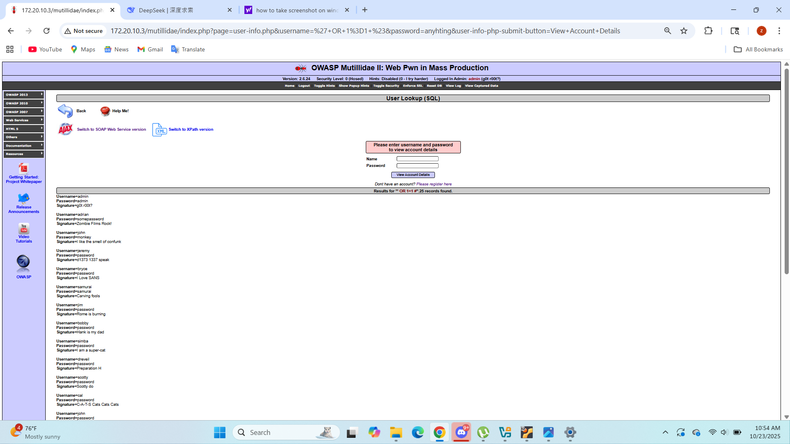

# SQL Injection & Database Exploitation Lab

## Project Overview
This project demonstrates the identification and exploitation of a SQL Injection vulnerability within the **OWASP Mutillidae II** web application. 

### Phase 1: Reconnaissance & Enumeration
I began by performing a network scan using **Nmap** to identify open ports and services on the target machine (`10.0.2.15`).

### Phase 2: Vulnerability Discovery
I identified a vulnerable user-lookup form. By injecting the logic `' OR 1=1 --`, I was able to manipulate the backend SQL query to return a `TRUE` value for all records.

### Phase 3: Exploitation
The successful injection allowed for a full database dump, exposing sensitive user information including usernames, passwords, and signatures.

## Remediation (The Fix)
To prevent this attack, the application should implement **Parameterized Queries (Prepared Statements)**. This ensures that user input is treated as data, not as executable code.
